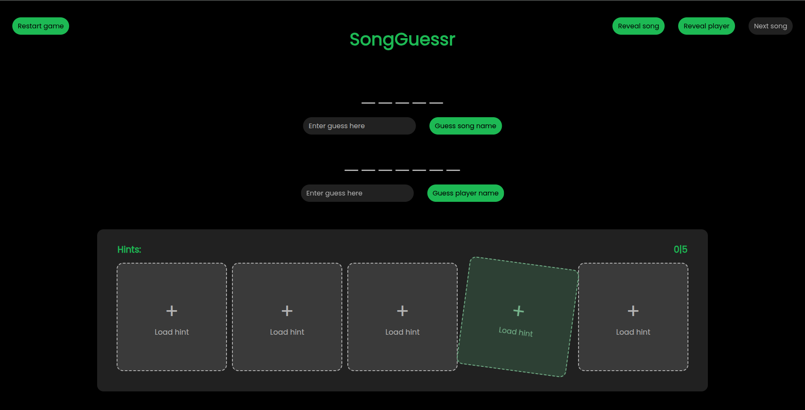

<h1 align="center">Welcome to my profile</h1>

## My Projects

Here you can find some basic information about my most important projects. 

If you would like to know more about them, feel free to dive deeper by checking out through the provided links.

I tend to lose interest in single projects quite often :sweat_smile:, so most of them are not actively maintained anymore, but I still have many ideas for future improvements and features. Maybe they will come in the future.

 

<h3 align="center">SongGuessr</h3>

**SongGuessr** is a fun web app that challenges you to guess the title of a song based on a variety of hints.

I originally created it as a surprise for my mom, as we played it all together on her birthday party.

You can also add the person's name who chose the song to add another layer of difficulty.

It consists of a backend API written in PHP and a frontend single page app running with plain JavaScript.

Currently, I am not actively working on this project anymore, but I still have some ideas for future improvements, especially regarding a better way of adding new songs.

[-> Repository page](https://github.com/cide0/songGuessr)

## Contact

Feel free to reach out to me. You can find me on the following platforms:

 [Elias Böhm](https://www.linkedin.com/in/elias-boehm/)

 [cide](https://x.com/c_i_d_e)

 [cide](https://discord.com/users/335124447700844564)