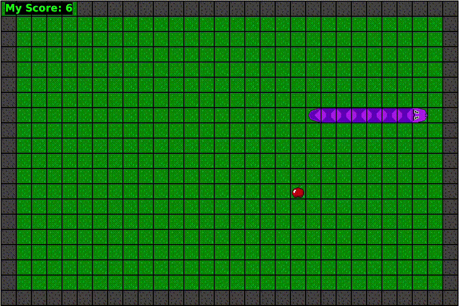
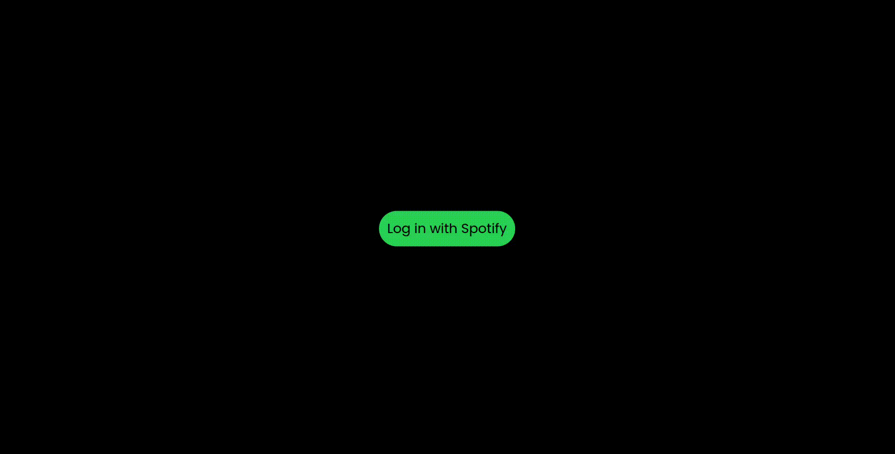
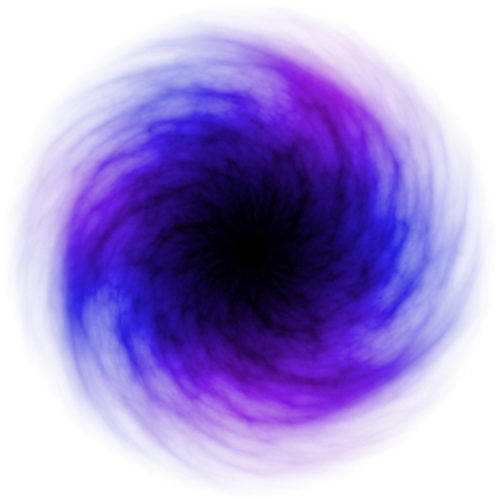
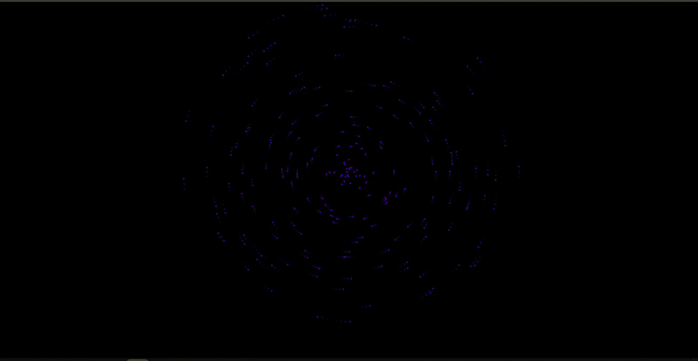
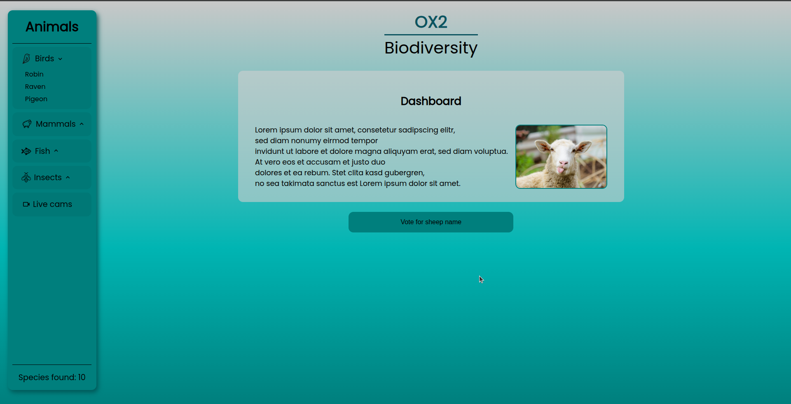

<h1 align="center">Welcome to my profile</h1>
 
<h2 align="center">My Projects</h2>

On here you can find some basic information about my most important projects and the current stuff I'm working on. 

If you would like to know more about them, feel free to dive deeper by checking out the provided links.

I tend to lose interest in single projects quite often :sweat_smile:, so most of them are not actively maintained anymore.

But I still have many ideas for future improvements and features. 

Maybe they will come some day, who knows.

  

<h2 align="center">Smija</h2>

Welcome to my first ever real coding project, which was the start of it all and got me into my career as a software developer.

This is a `Java`-based version of the classic game **Snake**, which runs in [Greenfoot](https://www.greenfoot.org/home), a `Java`-based IDE to learn the basics of OOP.

I created this game as a school project with a team of 3 other students in 10th grade.

It was my first touch with OOP and really sparked my interest in programming and software development. :heart:

I'm not working on it anymore, as it is fully functional and I want to keep the nostalgic feeling.

Have fun playing! :snake:

<a href="https://github.com/cide0/snake-og">-> Repository page</a>

    

<h2 align="center">SongGuessr</h2>

**SongGuessr** is a fun web app that challenges you to guess the title of a song based on a variety of hints.

I originally created it as a surprise for my mom, as we played it all together on her birthday party.

You can also add the person's name who chose the song to add another layer of difficulty.

It consists of a backend API written in `PHP` using `Slim` and a frontend single page app running with plain `JavaScript`. `MySQL` is used for the database.

Currently, I am not actively working on this project anymore, but I still have some ideas for future improvements, especially regarding a better way of adding new songs.

<a href="https://github.com/cide0/songGuessr">-> Repository page</a>

    

<h2 align="center">Spotify Video Matcher</h2>

This small web app allows you to watch YouTube music videos live for Spotify songs you are currently listening to.

It uses the Spotify API to get playback information and the YouTube Data API to search for the videos.

The frontend consists of a single page site running with `JavaScript` and `JQuery`, while the backend is a `Node.js` application using `express`.

Might contain rick-rolling! :trollface:

<a href="https://github.com/cide0/spotify-video-matcher">-> Repository page</a>

    

<h2 align="center">Circular</h2>

**Circular** is a small web page that lets you create fun circular animations with animated dots and basic math.

Check it out live here: [https://cide0.github.io/circular/](https://cide0.github.io/circular/)

It consists of a simple one-page frontend running with `JavaScript` and the `p5.js` library.

I still have many ideas for future add-ons, including more customization options and different presets. I will definitely work on it again some time in the future.

Until then, have fun trying it out! :relaxed:

<a href="https://github.com/cide0/circular">-> Repository page</a>

    

<h2 align="center">OX2 Biodiversity</h2>

This is a school project I worked on with a team of 3 other students as a part of my apprenticeship to become a web developer.

The goal of our group was to create a web application that allows users to explore and learn about the biodiversity in a planned solar panel project near Mariehamn for the company [OX2](https://www.ox2.com/).

It consists of a frontend single page application running with `Angular` and a backend API written in `PHP` using `Slim`.

This project was a lot of fun, and our class actually flew out to Mariehamn to visit the solar park area and meet the people behind OX2.

Sadly however, we didn't have enough time to implement every feature we had planned.

This project won't be maintained anymore, but feel free to check it out.

<a href="https://github.com/cide0/ox2-school-project">-> Repository page</a>

  
## Contact

Feel free to reach out to me. You can find me on the following platforms:

 [Elias Böhm](https://www.linkedin.com/in/elias-boehm/)

 [cide](https://x.com/c_i_d_e)

 [cide](https://discord.com/users/335124447700844564)

) [cide]([https://discord.com/users/335124447700844564](https://www.youtube.com/@c_id_e))